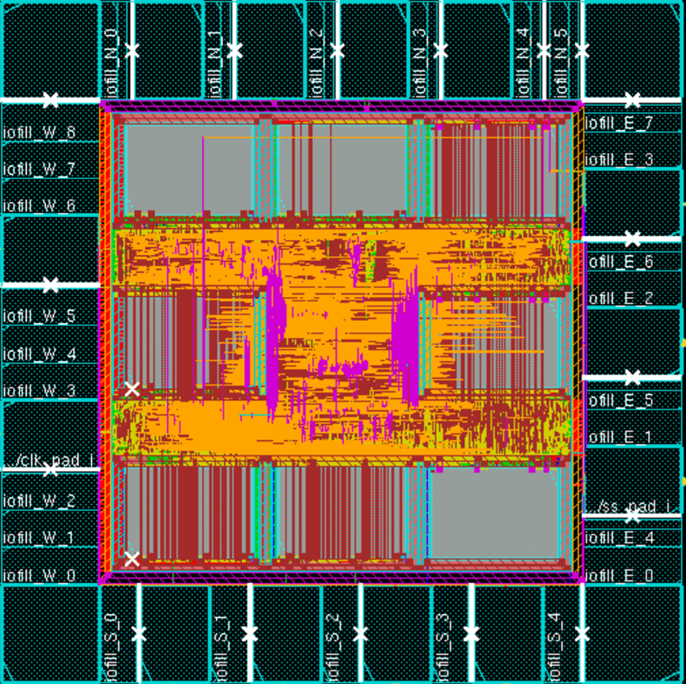
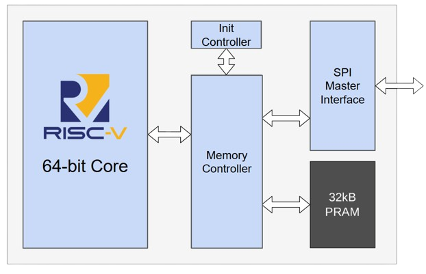
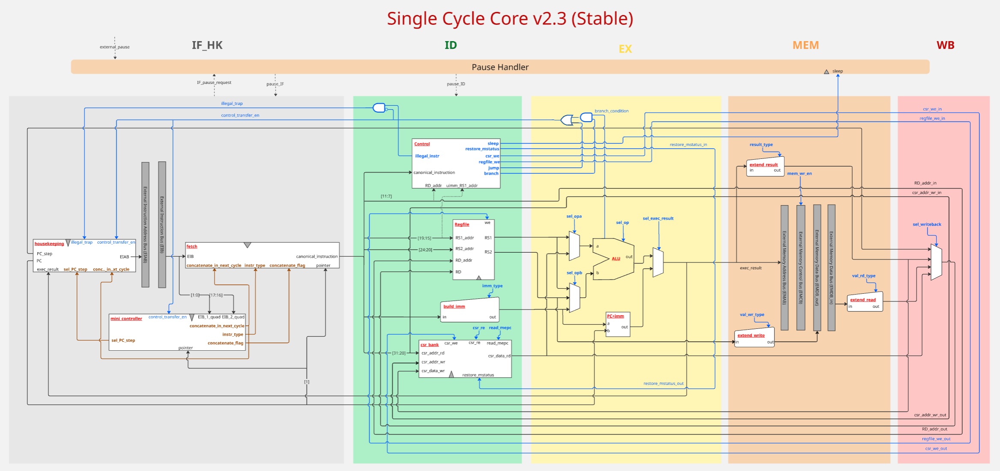
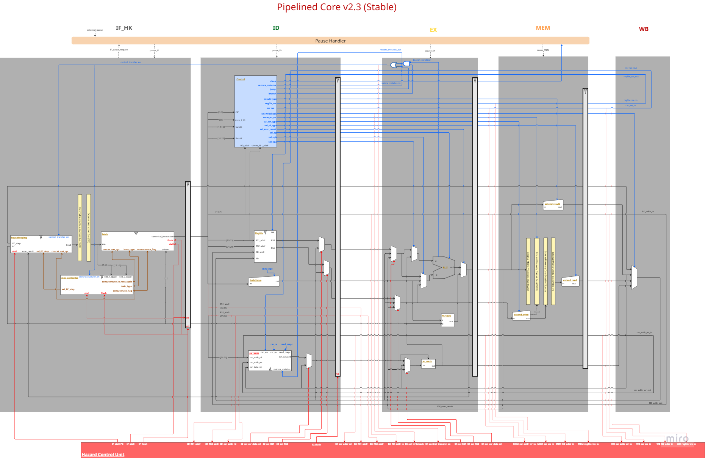
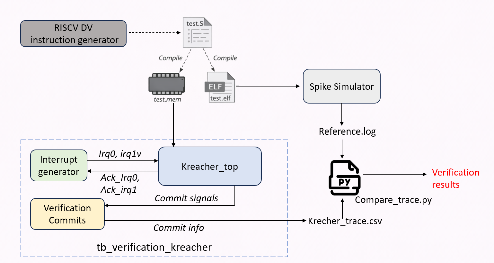
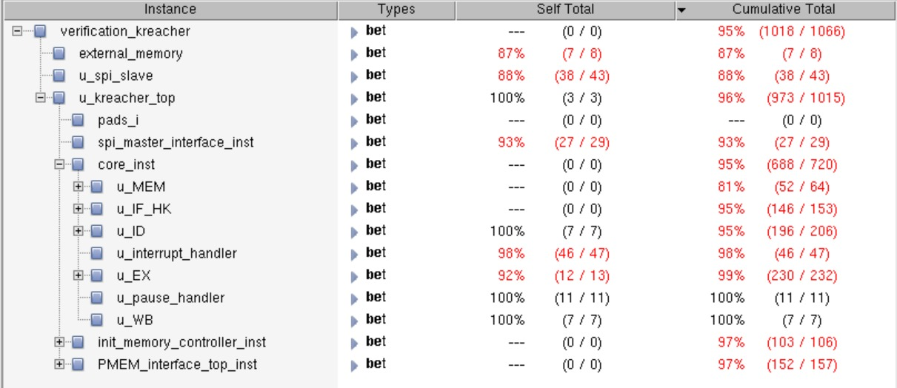
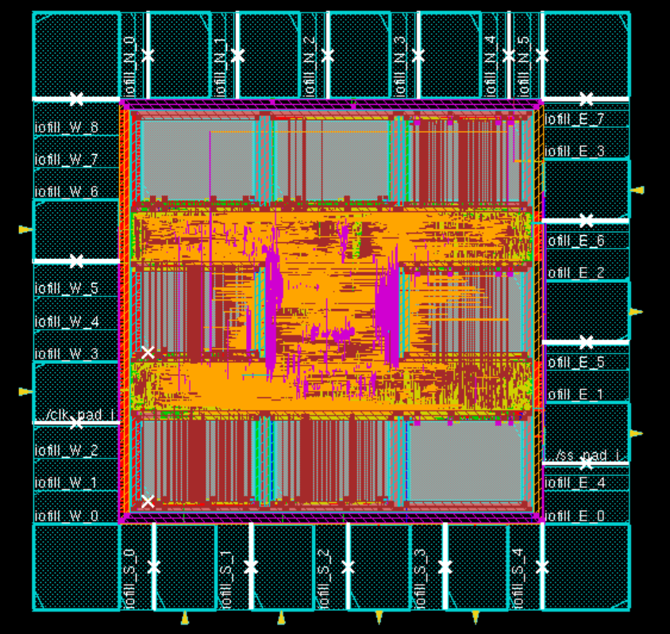
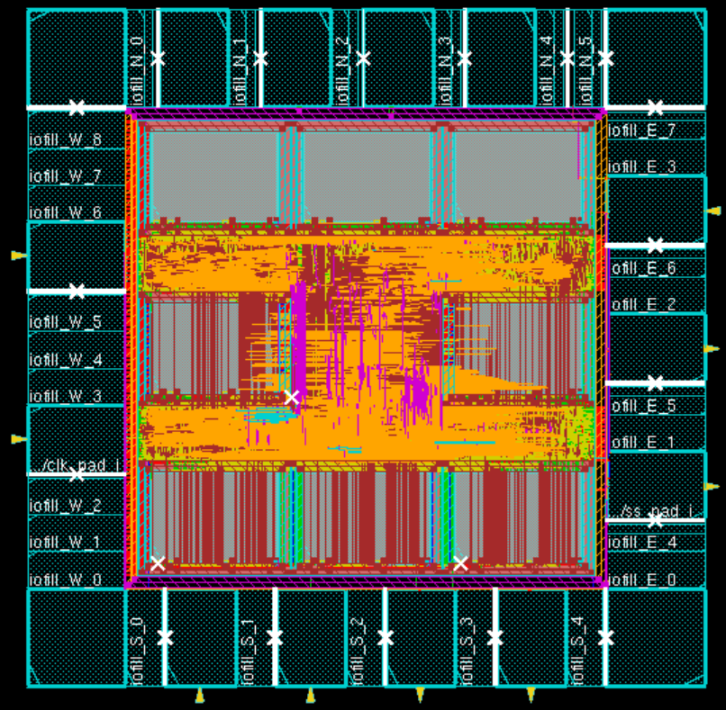

<div align="center">

# Kreacher — A RISC-V Based SoC Design for General Purpose Applications


</div>

<div align="center">


</div>

<div align="center">


*Figure: Final SoC layout*

</div>

---

## Team

| Name                            | Role                                                                                                  |
| ------------------------------- | ----------------------------------------------------------------------------------------------------- |
| **Jhon Steven Pinto Hernandez** | Team Lead · RISC-V Single-cycle & Pipelined core design · P&R optimization                                   |
| **Luanjia Cheng**               | Verification framework · Functional verification · Post-P&R validation                                |
| **Sanjai Palanisamy**           | Init/Memory controller · PMEM interface  · SoC integration · Synthesis & Physical Design |
| **Yongbo Wang**                 | SPI module · HAL linting · C validation programs                                                      |


---

## Overview

**Kreacher** is a verified, silicon-ready **64-bit RISC-V System-on-Chip (SoC)** designed at the RTL level and taken through synthesis and physical implementation. The project includes **two variants** sharing the same SoC platform but using different core types:

* **Single-cycle RV64IMC+Zicsr core**
* **5-stage pipelined RV64IMC+Zicsr core**

Both versions integrate the same SoC infrastructure, including **32 kB on-chip SRAM**, an **SPI master interface** for external memory access, a complete **boot-time initialization subsystem**, and **machine-mode interrupt/trap handling**.

<div align="center">


*Figure: Top-level block diagram of the Kreacher SoC*

</div>

> **Note:** Frequency, power, and area figures shown below correspond to the **pipelined SoC implementation**, unless stated otherwise.

| Attribute                     | Value                                        |
| ----------------------------- | -------------------------------------------- |
| ISA                           | RV64IMC + Zicsr (machine mode) + Privileged instructions for interrupt handling              |
| Datapath                      | 64-bit, little-endian                        |
| Core Variants                 | Single-cycle / 5-stage pipelined             |
| Clock Architecture            | Fully synchronous, single-clock              |
| On-chip SRAM                  | 32 kB                                        |
| Single-Cycle Max Frequency        | **33.3 MHz**                                 |
| Pipelined Max Frequency       | **84.74 MHz**                                |
| SoC Area                      | **347 µm²**                              |
| Power  (@ 84.74 MHz) | **208.8 µW**                         |
| Verification Coverage         | **93% (single-cycle)** / **95% (pipelined)** |
| Technology Node               | 28 nm                                        |


### External interface

| **Name**       | **Width** | **Direction** | **Comments**                              |
|----------------|----------:|--------------|--------------------------------------------|
| **I_CLK**      | 1         | In           | System clock                               |
| **I_A_RESET_L**| 1         | In           | System reset, asynchronous, active-low     |
| **O_SS**       | 1         | Out          | SPI-IF SS                                  |
| **O_MOSI**     | 1         | Out          | SPI-IF MOSI                                |
| **O_MISO**     | 1         | In           | SPI-IF MISO                                |
| **I_INTR_H**   | 2         | In           | External Interrupt request                 |
| **O_INTR_ACK** | 2         | Out          | External Interrupt acknowledge             |

---

## Table of Contents

* [Architecture](#architecture)
* [RISC-V Core Design](#risc-v-core-design)
  * [Single-Cycle Core](#single-cycle-core)
  * [Pipelined Core](#pipelined-core)
* [SoC Components](#soc-components)
  * [Init Memory Controller](#init-memory-controller)
  * [PMEM Interface](#pmem-interface-32-kb-sram)
  * [SPI Master Interface](#spi-master-interface)
* [Functional Verification](#functional-verification)
* [Synthesis & Physical Design](#synthesis--physical-design)
* [Validation](#validation)

---

## Architecture

The Kreacher SoC is organized around four major subsystems:


| Component                  | Description                                                                                  |
| -------------------------- | -------------------------------------------------------------------------------------------- |
| **RISC-V Core**            | Configurable processor variant: **single-cycle** or **5-stage pipelined** RV64IMC+Zicsr core |
| **Init Memory Controller** | Boot sequencer + memory router (Init Controller + Memory Controller)                         |
| **PMEM Interface Top**     | 32 kB on-chip SRAM with odd/even interleaved access                                          |
| **SPI Master Interface**   | External memory interface for boot-load and runtime external load/store                               |

**Key architectural features:**

* Two external interrupt inputs (**IRQ0 > IRQ1** priority)
* Program memory initialized via SPI on reset before execution begins
* Full machine-mode trap handling (**interrupt entry, MRET, WFI sleep/wake**)
* Structural hazard resolution between concurrent instruction fetch and data access
* Shared SoC platform reused across **both CPU microarchitectures**

---

## RISC-V Core Design

Both core variants share the same five functional regions:

```text
IF_HK → ID → EX → MEM → WB
```

They also support the same ISA subset and SoC integration model, allowing direct architectural comparison between a simpler baseline and a higher-throughput implementation.

### Single-Cycle Core

<div align="center">


*Figure: Single-cycle core top-level block diagram*

</div>

Although the datapath is logically partitioned into five functional regions, all stage logic is effectively coordinated in a single architectural flow using a global **Pause Handler** and an **Interrupt Handler** FSM.

**Module breakdown:**

* **IF_HK** — Program counter management, instruction fetch via the External Instruction Bus (EIB), and a *save-and-concatenate* logic that handles misaligned compressed instructions spanning two memory words.
* **ID** — Fully combinational instruction decoder generating all control signals; separates immediate generation (`build_imm`) from main decode logic; hosts the **register file** and **CSR bank**.
* **EX** — Operand-selection MUXes, ALU (6-bit operation selector handling arithmetic, logic, shifts, comparisons, CSR operations, and M-extension operations), PC+imm adder, and branch resolution.
* **MEM** — Sign/zero extension and external memory bus formatting (`extend_read`, `extend_write`).
* **WB** — Write-back selection (ALU result, memory read data, PC+step, or CSR data).


#### M-Extension: Radix-4 Booth Multiplier & Divider

The M extension (multiply/divide) is implemented as two iterative FSM-based submodules to avoid the excessive area cost of synthesis-inferred operators.

**Radix-4 Booth Multiplier FSM:**

```text
S_IDLE → S_LOAD → S_ITERATE (×32 cycles for 64-bit) → S_DONE → S_IDLE
```

For a 64-bit input, the multiplier processes **2 bits per cycle**, requiring **32 iterations**. It produces a **128-bit product**, from which the ALU selects `MUL`, `MULH`, `MULHU`, `MULHSU`, or `MULW`.

**Radix-4 Divider FSM:**

```text
S_IDLE → S_LOAD → S_ITERATE → S_DONE → S_IDLE
```

The divider converts operands to their absolute values, runs magnitude division, and then restores the architectural sign. Fast-path special cases (divide-by-zero, zero dividend, equal magnitudes) bypass the iterative algorithm entirely. During iteration, `EX_pause_request` stalls the core.

---

### Pipelined Core

<div align="center">



*Figure: 5-stage pipelined core top-level block diagram*

</div>

The pipelined core overlaps execution of up to **five instructions simultaneously**. Compared to the single-cycle baseline, after Physical Implementation it achieves a **~2.5× frequency improvement**.

This variant is the **performance-oriented implementation** of Kreacher and is the version used for the reported synthesis and physical design metrics.

**Key additions over the single-cycle design:**

| Feature                       | Description                                                                                   |
| ----------------------------- | --------------------------------------------------------------------------------------------- |
| **Inter-stage registers**     | Separate pipeline stages with explicit registered boundaries                                  |
| **Hazard Control Unit (HCU)** | Detects data and control hazards; generates `stall` and `flush` signals                       |
| **Operand forwarding**        | EX stage bypasses RS1/RS2 from MEM or WB stage results to avoid unnecessary stalls            |
| **CSR mask block**            | Enforces writable-field restrictions on `mstatus`, `mepc`, and `mcause` before CSR write-back |
| **Flush logic**               | `ID_flush` inserts pipeline bubbles on taken branches/jumps and interrupt entry               |

**Hazard handling:**

* **Data hazards** → forwarding from MEM/WB; load-use stall when required
* **Control hazards** → flush younger stages on branch/jump redirection
* **Structural hazards** → Scheduler stalls the core for 1 cycle on PRAM access conflicts
* **Interrupt entry** → HCU flushes in-flight instructions to establish a precise trap boundary

**Interrupt handling** uses the same FSM structure as the single-cycle core (`S_IDLE → S_TRACK → S_TAKE_WAIT_CLEAR_0/1`), but the HCU must first drain or flush younger instructions before redirecting the PC. The `WFI` instruction suspends pipeline execution until an interrupt arrives.

---

## SoC Components

### Init Memory Controller

The **Init Memory Controller** acts as the central interconnect between the core, the PMEM interface and the SPI master interface. Its primary function is to route core addresses to their correct target destinations while seamlessly managing the internal 18-bit address mapping. It contains an FSM with two operating phases:

**Phase 1 — Boot Sequence:**

```text
S_IDLE → S_START → S_WAIT (SPI burst read, 0x0000–0x7FFF) → S_FIRST_FETCH → ...
```

On reset, the SoC fetches the full **32 kB program image** from external SPI flash into PRAM before releasing the core. Initialization can be aborted early by **IRQ0**.

**Phase 2 — Normal Operation (including masked stores):**

```text
S_NORMAL_OP → S_PARTIAL_READ → S_APPLY_MASK → S_PARTIAL_WRITE → S_PARTIAL_STORE_DONE
```

External SPI memory does not natively support masked writes, so the controller implements a **read-modify-write** sequence for sub-word stores.

---

### PMEM Interface (32 kB SRAM)

The On-Chip program memory uses 8 SRAM macros from the PDK in a **4×2 odd/even interleaved** architecture:

* **32-bit instruction fetch** → single macro access
* **64-bit data load/store** → simultaneous even + odd macro access
* A **Scheduler** detects fetch/data collisions on the same macro and stalls for one cycle


---

### SPI Master Interface

The SPI master implements a 6-state FSM:

```text
S_IDLE → S_CS_LOW → S_HDR (16-bit header: R/W + 14-bit address)
       → S_RDATA / S_WDATA (64-bit data, MSB-first) → S_CS_HIGH → S_IDLE
```

**Capabilities:**

* Single-word read/write transactions
* **Burst mode** for PRAM initialization
* Byte-addressed external interface
* 64-bit aligned internal transfer path

---

## Functional Verification

<div align="center">


*Figure: Verification framework architecture*

</div>

The team developed a comprehensive **co-simulation verification framework** covering **both processor variants** and the shared SoC fabric.

| Tool                            | Role                                                                    |
| ------------------------------- | ----------------------------------------------------------------------- |
| **RISC-V DV** (Google)          | Random RV64IMC+Zicsr instruction stream generation (Final verification program contains ~3000 instructions) |
| **riscv64-unknown-elf-gcc**     | Cross-compilation to bare-metal ELF + binary extraction                 |
| **Spike ISA Simulator**         | Golden reference model; generates commit traces for comparison          |
| **Verification Commits module** | RTL prober capturing PC, instruction, `rd`, and CSR writes at WB stage  |
| **Interrupt Generator**         | Deterministic pseudo-random IRQ injection after initialization          |
| **compare_trace.py**            | Automated trace comparison with scoreboard generated through Spike; reports first mismatch location             |

**Test program coverage includes:**

* Random RV64IMC arithmetic, logic, shift, and compare instructions
* Legal Zicsr instructions (`mstatus`, `mepc`, `mcause`) with correct writable-field masks
* Properly aligned load/store operations to valid PRAM and external memory regions
* **Self-modifying code** — store instructions overwrite instructions in PRAM, validating the scheduler’s structural hazard resolution
* Interrupt handler entry/exit validation via `irq_trace.csv`

<div align="center">


*Figure: Coverage results for the pipelined core*

</div>

| Core             | Module/Unit Coverage | FSM State | FSM Arc  |
| ---------------- | -------------------- | --------- | -------- |
| **Single-cycle** | **93% (949/997)**    | **100%**  | **100%** |
| **Pipelined**    | **95% (1018/1066)**  | **100%**  | **100%** |

All major units exceeded **90% coverage**, including the pipelined **IF, ID, EX, MEM, and HCU** blocks. Remaining uncovered paths correspond primarily to corner cases identified as architecturally unreachable or non-practical under normal operation.

---

## Synthesis & Physical Design

> **This section reports implementation results for the *SoC using the Pipelined core* unless explicitly noted otherwise.**

Logical Synthesis was performed with **Synopsys Design Compiler** targeting a standard cell library in a 28 nanometers technology node, including SRAM macros and I/O pads.

### Logical Synthesis Results

| Clock Period | Frequency     | Slack (reg→reg) | Power    |
| ------------ | ------------- | --------------- | -------- |
| 11.80 ns     | **84.74 MHz** | 0.00 ns         | 208.8 µW |
| 10.22 ns     | 97.84 MHz     | −0.04 ns        | 241.5 µW |

> The selected operating point was **84.74 MHz**, providing a **timing-clean implementation** with non-negative critical-path slack.
> The custom radix-4 Booth multiplier and divider replaced synthesis-inferred `*` and `/` operators, significantly reducing area compared to generic arithmetic inference.

### Physical Design Flow (Cadence Innovus)

```text
Bind (constraints) → Floorplan (589×589 µm die) → Power Planning
→ Global Placement → Detailed Placement → Clock Tree Synthesis
→ Routing (DRC + SI + cross-talk) → Signoff → GDSII export
```

<div align="center">



*Top: chip layout with pipelined core · Bottom: chip layout with single-cycle core*

</div>

---

## Validation

Post-place-and-route correctness was confirmed by running four C benchmark programs in post-implementation simulation (Cadence SimVision) and checking the output signature written to address `0x4000`:

| Program             | Description                                           | Signature    |
| ------------------- | ----------------------------------------------------- | ------------ |
| `matmul_test.c`     | 16×16 integer matrix multiplication                   | `0x0b33p2c9` |
| `cpu_stress_test.c` | Multi-width load/store, div/rem, 32/64-bit arithmetic | `0x857319ea` |
| `fft_test.c`        | 64-point fixed-point FFT (Q15 twiddle factors)        | `0x2de8aac0` |
| `aes128_test.c`     | AES-128 encryption (S-box + key schedule + 10 rounds) | `0xc063dcde` |

All four programs produced matching signatures between native host execution and hardware simulation, confirming functional correctness after full physical implementation.

---


<div align="center">


</div>
